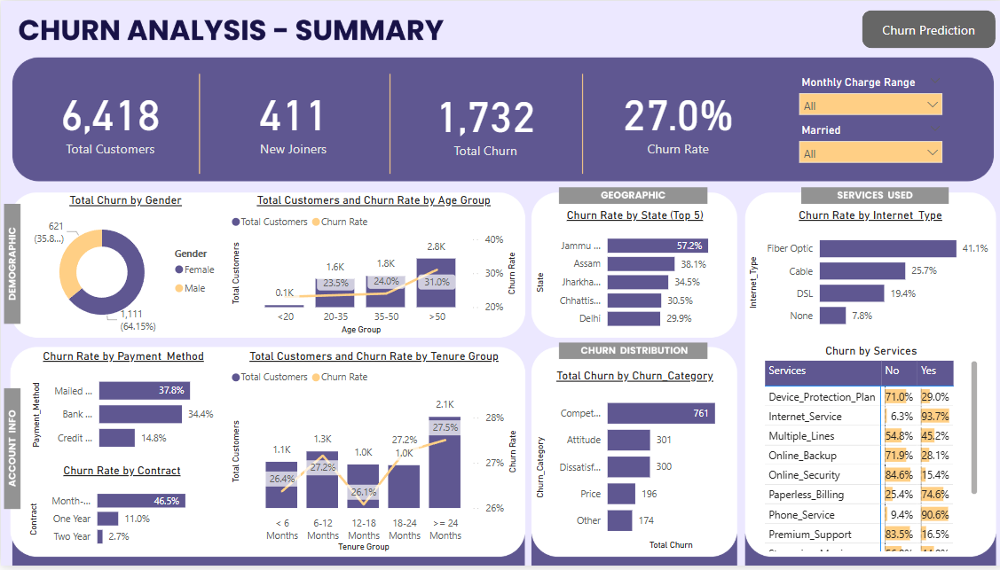
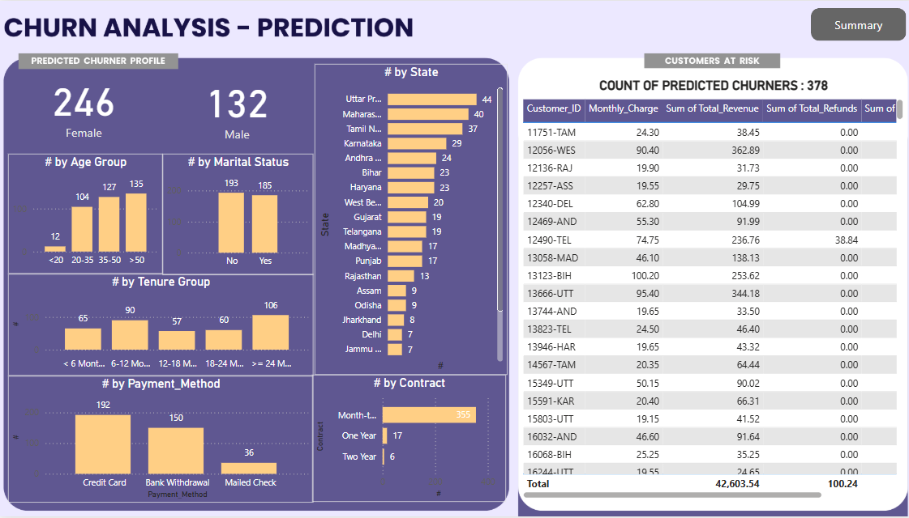

# Churn Data Analysis

This project presents a complete end-to-end churn analysis workflow for a telecom company, incorporating data engineering, visualization, and machine learning. It is designed to help identify patterns in customer churn behavior and support proactive retention strategies.

## Technologies Used

- **SQL Server Management Studio (SSMS)**  
  Used for data import, cleansing, transformation, and creation of analytical views.

- **Power BI**  
  For building the data model and designing interactive dashboards with professional visualizations.

- **Python (Jupyter Notebook)**  
  For implementing the machine learning pipeline:
  - `pandas`: Data manipulation and preprocessing
  - `numpy`: Numerical operations and feature importance ranking
  - `scikit-learn`: Churn prediction using Random Forest and evaluation metrics
  - `matplotlib`, `seaborn`: Data visualization for feature insights

## Project Workflow

### 1. Data Engineering (SQL Server)
- Created a structured relational database (`db_Churn`) using raw telecom customer data.
- Loaded and staged data from CSV files into SQL tables.
- Performed data exploration: null checks, handling duplicates, checking distinct values.
- Cleaned and transformed data into production-ready tables.
- Created views for Power BI consumption.

### 2. Data Visualization (Power BI)
- Connected Power BI to SQL views.
- Designed a comprehensive dashboard covering:
  - Customer demographics
  - Churn trends by contract and services
  - Revenue and usage metrics
- Incorporated a dedicated **Churner Profile** page using ML predictions.
- Applied a soft pastel theme for a clean, professional look.

### 3. Machine Learning (Python)
- Trained a Random Forest Classifier to predict customer churn.
- Performed feature selection using model importances.
- Evaluated model using confusion matrix and classification report.
- Applied model to a new prediction dataset.
- Exported predictions for use in Power BI.

## Repository Structure

| File / Folder                  | Purpose |
|-------------------------------|---------|
| `00_createDatabase.sql`       | Initializes the churn database |
| `01_data_exploration_distinctValues.sql` | Checks distinct values for categorical fields |
| `02_Check_Nulls.sql`          | Null value inspection |
| `03_RemoveNulls_ProdTable.sql`| Cleansing and data transformation |
| `04_views.sql`                | Creates analytical views |
| `Churn Analysis.pbix`         | Power BI dashboard |
| `Churn Prediction.ipynb`      | ML model implementation and prediction |
| `Customer_Data.csv`           | Original customer data |
| `Prediction Data.xlsx`        | New data for churn prediction |
| `Predictions.csv`             | Model output for dashboard integration |

## How to Run the Project

1. Import `Customer_Data.csv` into SQL Server.
2. Execute SQL scripts in order (`00` to `04`) to build the data pipeline.
3. Open `Churn Analysis.pbix` in Power BI and connect it to your SQL database.
4. Run `Churn Prediction.ipynb` to train the model and generate predictions.
5. Load `Predictions.csv` into Power BI to activate the Churner Profile visuals.

